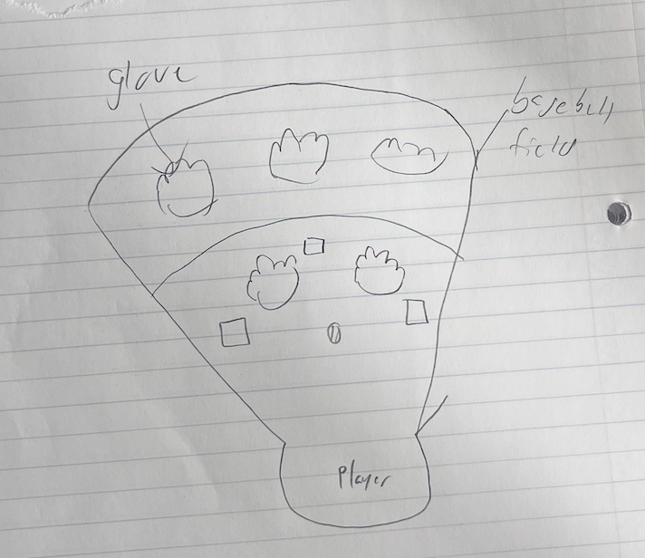
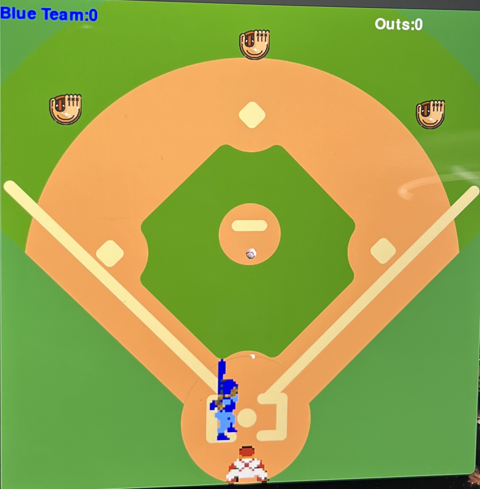

# CS110 Project Proposal
#  Homerunderby  
## CS 110 Final Project
### 2022
### [Homerun Derby ]

(https://replit.com/join/otwtauqvwq-samuelmontes4)

[[https://docs.google.com/document/d/1H4R6yLL7som1lglyXWZ04RvTp_RvRFCCBn6sqv-82ps/edit?usp=sharing](https://docs.google.com/presentation/d/1zqiMemVgJ-EeHS74m7AGa7LcEslUmwWL4S0-E4M6OuI/edit#slide=id.p)

### Team: Team 3
#### Sam Montes, Colin Grace

***

## Project Description

Homerun derby where P is to pitch and space is to swing the bat. The gloves prevent the ball from becoming a homerun. If you miss the ball its an out and if the ball goes foul or is caught by the outfielders it is an out.

***    

## User Interface Design

- **Initial Concept**
  - 
    
    
- **Final GUI**
  - 

***        

## Program Design

* Non-Standard libraries
    
* Class Interface Design
    * 
        *  
* Classes
    * Bat - Sprite that collides with ball with swininging animation
    * Catcher - sprite that resets the ball if it didnt collide with the bat 
   
    * Ball collides with outfielder for out catcher for reset and decides if points get scored
    * Outfielder resets the ball if collided with it 
    * Scoreboard that keeps track of player score and outs
    * controller - runs the code 

## Project Structure and File List

The Project is broken down into the following file structure:

* main.py
* src
    * ball.py
    * bat.py
    * controller.py
    * catcher.py
    * outfielder.py
    * scoreboard.py
* assets
    * field.png
    * glove.png
    * catcher.png
    * b1.png
    * b2.png
    * b3.png
    * b4.png
    * b5.png
    * b6.png
    * baseball.png
    
* etc
    *

***

## Tasks and Responsibilities 

   * Outline the team member roles and who was responsible for each class/method, both individual and collaborative.

## Testing

* We would focus on one block of code run it and then debug. We would continue to repeat the process and build up slowly little by little
To first understand we knew what we were doing we coded most of our project in a test file to make sure it ran right. After we divided into separate files

## ATP

| Step                 |Procedure             |Expected Results                   |
|----------------------|:--------------------:|----------------------------------:|
|  1                   | Run Counter Program  |GUI window appears with count = 0  |
|  2                   | press p                | ball gets thrown towards bat  |
|  3                   | press space as ball aligns with batter| batter swings       |
|  4                  | repeat process         |steps 2 and 3 repeat   |

